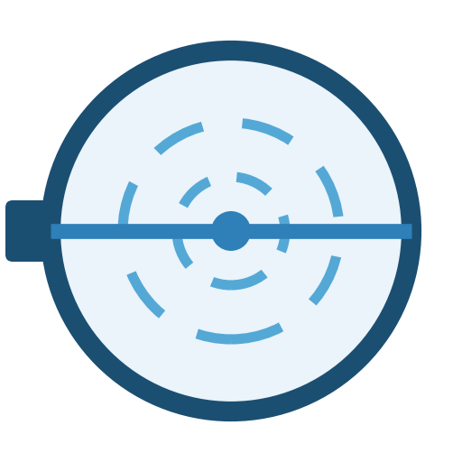
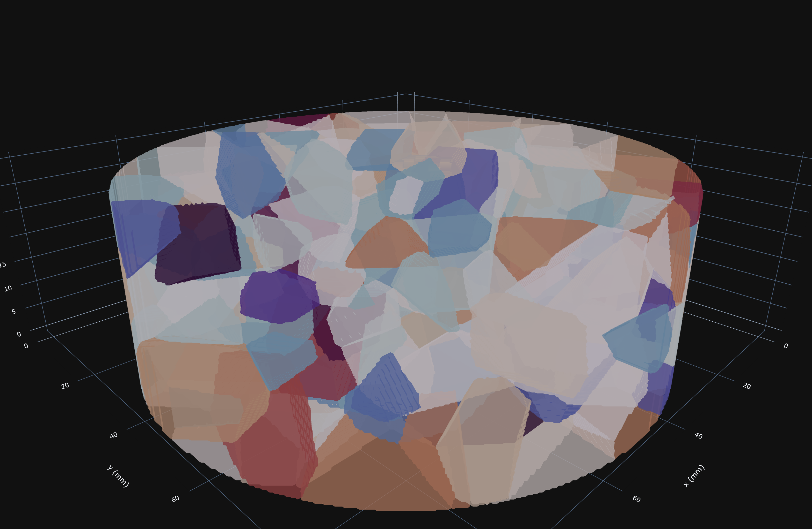
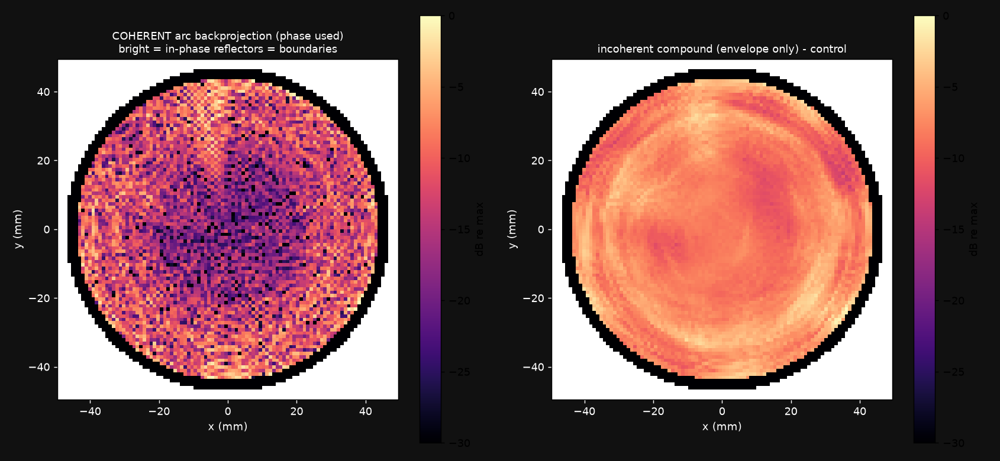

#  Pulse-Echo Azimuthal Simulation

<p align="center">
  
</p>

The digital twin of the pulse-echo azimuthal measurement: everything
needed to simulate, corrupt, and invert rotational single-transducer
ultrasound on a polycrystalline ice disk. The code builds synthetic
disks with controlled crystal orientation fabric (COF), propagates
pulses through them with a validated anisotropic FDTD solver
(cross-checked against an independent finite-element solver), applies
the acquisition error model of the physical machine, and reconstructs
the fabric from the simulated echoes.

It is the simulation companion to the
[Pulse-Echo Azimuthal Scanner](https://github.com/Jerome-Graves/pulse-echo-azimuthal-scanner),
the physical instrument, and the evidence base for the journal
manuscript on the method. Everything the paper claims traces to a
script in this repository, usually with the quoted numbers recorded in
that script's docstring. Negative results are kept deliberately: they
are part of the evidence chain, not clutter.

## The GUI

Double-click **`Run Simulation GUI.bat`**. The first run installs a
private Python runtime into `gui/runtime/` (internet required, a few
minutes); afterwards it starts offline, creates an icon-bearing
shortcut for day-to-day use, and opens at http://localhost:8552.

The studio walks the whole pipeline in tabs: build a specimen (disk
geometry, grain count, fabric strength and direction), configure the
probe and excitation, choose the error model, run the acquisition, and
reconstruct. The FW sweep tab drives the full-wave azimuth sweep
engine. Running new full-wave simulations needs CUDA and cupy; the
specimen builder, ray model, error model and every analysis view run
on CPU.

<p align="center">
  
</p>

## Reproduce a paper number in three commands

No GPU required. This recomputes the Appendix A direct-arrival
attenuation agreement between the two solvers from the archived
arbiter traces:

```
git clone <this repository>
cd pulse-echo-azimuthal-simulation/sim/analysis
python fe_direct_attenuation.py
```

Expected: a table of the five cross-check rounds ending with FDTD
-1.367 dB against FE -1.341 dB (0.027 dB gap) for the 6-15 mm
placement, and agreement spanning 0.014 to 0.068 dB over the three
valid rounds. Any cited module works the same way: run it from its own
directory and compare the printed numbers against the ones recorded in
its docstring.

## Directory map

| path | what it is |
|---|---|
| `sim/` | The solver and production stack. Read `sim/README.md` first: it is the ground-truth document for what every file is and why it exists. |
| `sim/core/` | The solver and specimen machinery: label-indexed anisotropic FDTD, pseudospectral solver, specimen builder, rotation machinery, bit-equivalence gate. |
| `sim/model/` | Forward models and inversion: the born ladder, fabric inversion, gridded inversion and its daemon, the studio ray model. |
| `sim/pipeline/` | Drivers: the resumable sweep engine, the original azimuth study, trace lab, arc backprojection, visualisation. |
| `sim/fe_crosscheck/` | The FE arbiter that cross-checks the solver: mesher, solvers, probes, the five cross-check rounds and their trace archives. |
| `sim/fw_checks/` | Solver validation and acceptance studies: full-wave references, oblique and pseudospectral validation, anisotropy and convergence checks. |
| `sim/analysis/` | About 75 analysis modules plus their stored results, in subdirectories by theme. See `sim/analysis/README.md`. |
| `sim/validation/` | Rotated-staggered-grid and exact reflection-coefficient studies. |
| `sim/ref/` | Clean reference traces (inputs to the paper's figures). |
| `sim/runs/`, `sim/results/` | Batch drivers for the GPU campaigns and their stored results. |
| `sim/figures/` | The paper's figure scripts. |
| `gui/` | The Streamlit studio and FW sweep tab, plus the launcher runtime scripts. |
| `docs/` | The LaTeX simulation manual. |
| `out/` | Sweep sessions, tessellation cache and observables (not versioned; deposited with the paper). |

## Environment

Python 3.12. The version pins in `requirements.txt` are a reproduction
contract, not a suggestion: the analysis gates compare against archived
results at zero difference, and other library versions move floating
point at the 1e-13 level, which trips the bit-exactness gates by
design. The launcher installs exactly the pinned versions.

CUDA and cupy are needed only to run the solvers and so to regenerate
sweeps or reference traces; every module under `sim/analysis/` runs on
CPU from stored data.

## Documentation

The simulation manual (model, solver validation chain, error model,
inversion, software architecture) is in
[docs/simulation-manual.pdf](docs/simulation-manual.pdf), built from
the LaTeX sources alongside it. `sim/README.md` remains the
authoritative file-by-file map.

## Related publications

- J. Graves, S. Harput, B. Lishman.
  *A Finite-Difference Simulation Framework for Ultrasonic Crystal
  Orientation Fabric Estimation in Ice: Timing Methodology, Forward
  Model Selection, and the Cramer-Rao Accuracy Limit.*
  IEEE International Ultrasonics Symposium, 2026 (accepted). The paper
  this repository underpins.
- J. Graves, S. Harput, B. Lishman.
  *Non-Destructive Ultrasonic Estimation of Ice Crystal Orientation
  Fabric: Multi-Frequency Experimental Validation and Failure Mode
  Characterisation.* IEEE International Ultrasonics Symposium, 2026
  (accepted). The experimental companion, measured on the
  [physical scanner](https://github.com/Jerome-Graves/pulse-echo-azimuthal-scanner).
- J. Graves, B. Lishman, S. Harput.
  *Measuring Predominant Orientations of Ice Crystal Fabrics From
  Ultrasonic Measurements of Ice Cores.* Preprint.
- J. Graves, B. Lishman, S. Harput.
  *Determining the Grain Geometry From Ultrasonic Measurements of
  Large-Grained Temperate Ice Cores.* IEEE International Ultrasonics
  Symposium, 2023.
  [doi:10.1109/ius51837.2023.10307539](https://doi.org/10.1109/ius51837.2023.10307539)

The full list, with paper PDFs as they become available, is at
[jeromegraves.com](https://jeromegraves.com/#publications). An archived
DOI for this repository will be added on publication of the 2026
papers.
